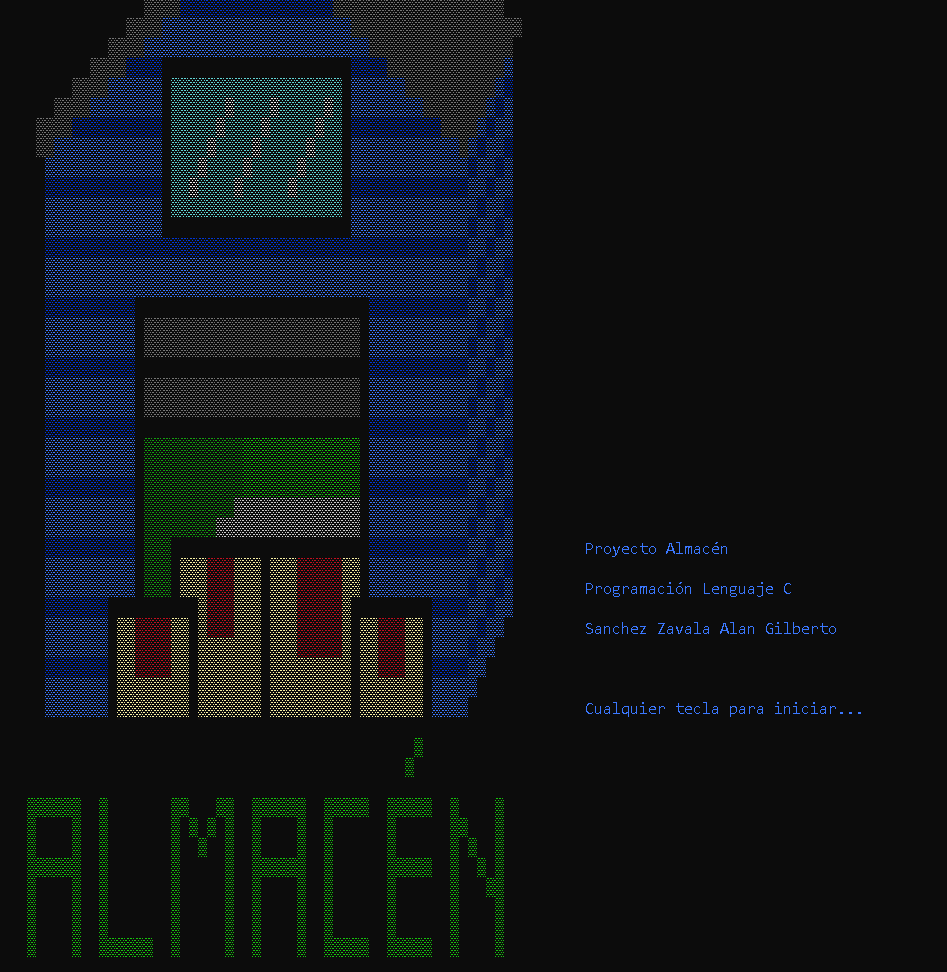

Sistema de Gestión ERP en Consola (C++)

Este proyecto es un sistema integral de **Planificación de Recursos Empresariales (ERP)** que opera completamente en la consola de Windows. Fue diseñado para gestionar el ciclo completo de ventas: desde el control de inventario hasta la facturación y seguimiento de pedidos.

El sistema destaca por no utilizar librerías gráficas externas, sino que explota al máximo la API de Windows (`windows.h`) para crear una experiencia de usuario rica, interactiva y visualmente atractiva.

Características Principales
Experiencia de Usuario (UX) Avanzada
- Navegación Interactiva: Menús controlados por flechas del teclado (↑ ↓) con retroalimentación visual inmediata.
- Motor de Renderizado ASCII: Módulo personalizado (`decorar.h`) que lee matrices de datos desde archivos externos para renderizar gráficos complejos (pixel art) en la consola.
- Interfaz Coloreada: Uso dinámico de atributos de color para diferenciar estados (Verde=Activo, Rojo=Cancelado, Azul=Entregado).

Ingeniería de Software y Lógica
- Persistencia de Datos (Custom File System): Sistema propio de bases de datos basado en archivos de texto planos con formato `.xls` (separados por tabuladores), permitiendo auditoría directa en Excel.
- Gestión de Memoria Dinámica: Uso de punteros y asignación de memoria (`malloc`) para la gestión temporal de pedidos antes de su escritura en disco.
- Algoritmos de Validación:  Verificación lógica de correos electrónicos (análisis de sintaxis `@` y `.`).
  - Validación de tipos de datos robusta (evita crashes por entradas incorrectas).
- Operaciones CRUD Complejas: Modificación de registros mediante técnica de archivos temporales (swap files) para garantizar la integridad de los datos.

Estructura Modular del Proyecto

El código sigue el paradigma de Programación Modular, separando la lógica en archivos de cabecera específicos:

`principal.cpp.' 
Punto de entrada (`main`) y configuración del entorno de ventana. 

`apuntadores.h`
Lógica de Negocio: Gestión de pedidos, clientes, generación de IDs aleatorios y cambios de estado. Utiliza apuntadores para hacer referencia a ubicaciones de memoria

`estructura.h`
Gestión de Inventario: Altas y modificaciones de productos y manejo de archivos. 

`decorar.h`
Motor Gráfico: Renderiza la portada leyendo coordenadas y colores desde `portada.txt`. 

`menu.h`
Interfaz: Controla el flujo de navegación y la captura de teclas. 

`validaciones.h`.
Seguridad: Filtros de entrada para Enteros, Flotantes y Strings. 

`libreria.h`
Configuración: Definiciones globales, estructuras de datos (Structs) e includes. 

Tecnologías Utilizadas
-Lenguaje: C++
-Entorno: Optimizado para Windows (Consola).
-Librerías: windows.h`, `stdio.h`, `stdlib.h`, `conio.h`.

